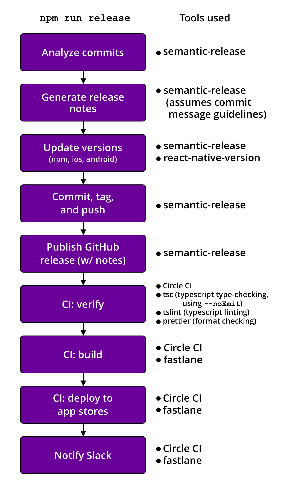

I'm a fan of React Native. It allows me to build native mobile apps using JavaScript. That's no small feat, but no tool is perfect. React Native has its frustrating quirks and time-consuming challenges, as any library as heavy as React Native might. Automating deployment has been one of those challenges. I've fiddled with deployment processes across several projects over the years and I was never really satisfied with the results. It took many iterations: adding new tools, removing stale ones, using old tools in new ways, but I recently realized that I reached my goal.

I should point out that I didn't create some silver bullet to the deployment problem. I am simply using existing tools in intended, documented ways. Look at any individual piece, and there's nothing original. What I believe is special, and what I am excited to share, is the way the tools are combined to form a seamless, single-command, automated deployment process from commit to app store.

Part 1 will establish some project assumptions that are required for this process to work, and then walk through the first half of the setup. This is meant to be an example of what is possible. Some of these tools have alternatives that would be relatively easy to swap–such as Circle CI with pretty much any other CI–but I'm going to stick with what I used and maybe you can take it from there.

To see everything put together, check out [the working example repo with all code samples](https://github.com/timmywil/react-native-deployment-example).

## Bird's eye view

When this series is complete, you should have a working deployment flow that runs with one command: `yarn release` (or `npm run release`). Here's an overview of the whole process:



_Note: e2e testing is not part of this flow. It assumes the previous commit has already passed all tests. Setting up testing for supported devices in CI is another beast. I may share that in a later post._

### You know what happens when you assume

This workflow assumes some things about the project. It assumes you have a project structure similar to mine. That is, similar to the one generated by `react-native init`. Most of this should work in an expo project, but I haven't used expo that much so I can't say for sure.

#### Commit message guidelines

The critical assumption is that all commits for the release follow some commit message guidelines. This is necessary for determining a proper [semantic version][semver] and generating release notes from commit messages.

You're not tied to the [format I use][config-conventional], but each commit should at least have a scope, a subject, and some keyword to denote a breaking change. There are several possible presets. Have a look at [@semantic-release/commit-analyzer][commit-analyzer] for the possible configs. I also recommend checking out [commitlint][commitlint] and [husky][husky] for enforcing commit message guidelines on commit. [commitizen][commitizen] is nice if you'd like a prompt to use when committing. The config I use for this blog is available on my [GitHub][blog-github]. Check out the [package.json][blog-github-package] and [commitlint.config.js][blog-github-commitlint]

#### [TypeScript]

It's not necessary that you use TypeScript, but a few of my code examples will use the TypeScript compiler and [tslint][tslint]. You could swap those with tools such as [eslint][eslint]. [prettier][prettier] works with both TypeScript and Vanilla JavaScript.

## Dependencies for part 1

```bash
$ yarn add --dev \
semantic-release \
@semantic-release/git \
react-native-version
```

## Setting up semantic-release

Add this script to your `package.json`:

```json
"scripts": {
  "release": "semantic-release"
  ...
}
```

Next, double check [git authentication][semantic-release-git-authentication], which involves setting some environment variables. Then create a GitHub token for semantic-release-bot. The [@semantic-release/github docs][semantic-release-github] explain how to do this. Specifically, follow [this guide][creating-github-token] and set `GH_TOKEN` in your environment. The token will allow the semantic-release-bot to use the GitHub API to push release notes.

Here's an example config to use for semantic-release.
Replace `$PROJECTNAME` with your own project name.

```json
"release": {
  // Release from this branch
  "branch": "master",
  // This isn't an npm package
  "npmPublish": false,
  // We're initiating the release from
  // our local machine. You could set this
  // to true and set up releasing on every push
  // to the release branch, but I like
  // pulling the trigger myself.
  "ci": false,
  "plugins": [
    // Analyzes commit messages and
    // determines the version
    "@semantic-release/commit-analyzer",
    // Builds release notes from commit messages
    "@semantic-release/release-notes-generator",
    // Updates the version
    "@semantic-release/npm",
    [
      // Commits, tags, and pushes
      "@semantic-release/git",
      {
        "assets": [
          "ios/$PROJECTNAME*/Info.plist",
          "ios/$PROJECTNAME.xcodeproj/project.pbxproj",
          "android/app/build.gradle",
          "package.json"
        ],
        "message": "chore(release): ${nextRelease.version} \n\n${nextRelease.notes}"
      }
    ],
    // Creates the release on GitHub
    // and posts release notes
    "@semantic-release/github"
  ]
}
```

### Updating the version

There's an important package that works in conjunction with `@semantic-release/npm` that makes releasing to the app store possible. If we stopped here, only the version in `package.json` would get updated, resulting in errors later on CI when deploying to the app stores. [react-native-version][react-native-version] is needed to update the versions in android and ios.<sup>[1](#notes)</sup> It piggybacks off of the command used to update the `package.json` version and uses the same version to update android and ios files.

Make sure it's installed and add this to your `package.json`:

```json
"scripts": {
  "postversion": "react-native-version"
  ...
}
```

Side note: you can add `pre` or `post` to any script and it will run before or after that script. That includes custom scripts, by the way.

### The git commit

After updating the version, `@semantic-release/git` is responsible for staging the changed assets, committing those assests, tagging the commit, and pushing it to GitHub. But you have to be explicit about which files to add. The files listed above are all of the files that `@semantic-release/npm` and `react-native-version` changes.

The message is mostly default with one important difference. It removes `[skip ci]` from the end of the message. We do not want to skip CI.

### Signing commits with GPG

If you already have GPG set up for signing commits <sup>[2](#notes)</sup>, you may also want to enable signing commits and tags made by semantic-release. This is easy to do in our case since we're committing from our local machine. The fix is to commit using your own name and email rather than than the default name and email used for the bot. <sup>[3](#notes)</sup> Make sure these environment variables are set to the ones matching your GPG signature:

```bash
GIT_AUTHOR_NAME
GIT_AUTHOR_EMAIL
GIT_COMMITTER_NAME
GIT_COMMITTER_EMAIL
```

If you opted to run semantic-release in CI, the [`@semantic-release/git` docs][semantic-release-git] explain how to sign commits on Travis.

### Conclusion

Try running `yarn release -d` or `npm run release -- -d` to do a dry run of what you have so far. If everything is set up correctly, you're halfway to single-command deployment. In the next part, we'll discuss setting up fastlane and Circle CI, which will take care of linting, building, and actually deploying to Testflight and Google Play, as well as posting a message to Slack.

<a name="notes"></a>

<details>
<summary>Notes</summary>
<style>small, small code { font-size: 80%; line-height: 1; }</style>

<small><strong>1</strong>: If you've used fastlane before, you may have used that to update versions in iOS and Android and are wondering why this is better. First, this does more than existing fastlane plugins. For example, while it's easy to increment the version code in Android using a fastlane plugin, it's not so easy to update the version name at the same time, which should really match the version we use in `package.json`. But the main reason to use `react-native-version` is using fastlane in CI is too little too late. If we tried to update versions when deploying to the app stores, we'd have to jump through several hoops to get those changes included in our git tag. We want a clean, atomic release, and git tags are perfect for that. fastlane would have to amend the commit and tag. Overall, it's simpler to do it when updating the `package.json` version. You may also be wondering why we're using fastlane on CI instead of our local machine. We'll get to that in part 2.</small>

<small><strong>2</strong>: A while back I wrote [a guide](https://medium.com/@timmywil/sign-your-commits-on-github-with-gpg-566f07762a43) on signing commits with GPG, including saving the passphrase so you don't have to enter it every commit.</small>

<small><strong>3</strong>: I ran into an issue with this. I had the environment variables defined in my `.bash_profile`, but wasn't using `export` (e.g. `export GIT_AUTHOR_EMAIL=$EMAIL` rather than `GIT_AUTHOR_EMAIL=$EMAIL`). The reason for `export` is to make the variable available to other processes, like `node`. Make sure to use `export`.</small>

</details>

[blog-github]: https://github.com/timmywil/timmywil.github.io
[blog-github-package]: https://github.com/timmywil/timmywil.github.io/blob/decfa4eceab3a840ecd3969ca346c65ecf5ef7a6/package.json#L95
[blog-github-commitlint]: https://github.com/timmywil/timmywil.github.io/blob/decfa4eceab3a840ecd3969ca346c65ecf5ef7a6/commitlint.config.js
[semantic-release-git-authentication]: https://github.com/semantic-release/git#git-authentication
[semantic-release-github]: https://github.com/semantic-release/github#github-authentication
[creating-github-token]: https://help.github.com/en/articles/creating-a-personal-access-token-for-the-command-line
[config-conventional]: https://www.conventionalcommits.org
[tslint]: https://github.com/palantir/tslint
[eslint]: https://eslint.org/
[prettier]: https://github.com/prettier/prettier
[semver]: https://semver.org/
[commit-analyzer]: https://github.com/semantic-release/commit-analyzer#configuration
[commitlint]: https://github.com/conventional-changelog/commitlint#readme
[commitizen]: https://commitizen.github.io/cz-cli/
[husky]: https://github.com/typicode/husky#readme
[react-native-version]: https://github.com/stovmascript/react-native-version#readme
[semantic-release-git]: https://github.com/semantic-release/git#gpg-signature
