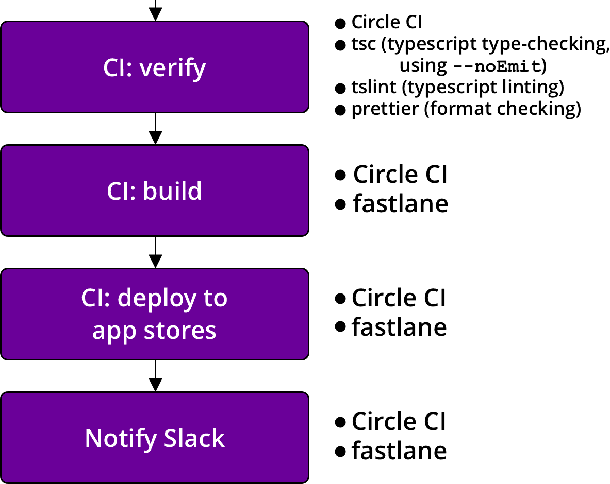

In [part 1][part-1], we discussed how to set up [semantic-release][semantic-release] and [react-native-version][react-native-version]. That covers the first part of the deployment flow from commit to GitHub. In this post, we'll take a look at the configs for verification and deployment. The CI configs shared in this post are for Circle CI, but the workflow can be applied to any CI. Here's what we'll cover:



_Disclaimer: this might be hard to set up from scratch. It will be easier for those with existing projects to migrate to this workflow and make changes where things are different._

## Verification

The purpose of this verification step is to run some sanity checks, not to run the full test suite. That should already have been done using the same package on the previous commit. The only changes to the package should be the version number edits, so we run some simple linting checks and perhaps the unit tests.

We also want to keep the deployment as reliable and fast as possible. If you have experience running integration or e2e tests for React Native apps in CI, you'll know that "reliable" and "fast" are usually not words used to describe those types of tests, especially when running tests for both iOS and Android on multiple supported devices.

Here's a sample config for a simple job that installs node dependencies, lints, runs unit tests, and saves the workspace for later use. We're using `yarn` here, but if you prefer `npm`, swap `yarn.lock` with `package-lock.json` and edit `yarn` commands to use `npm run`.

```yml
version: 2
references:
  restore_yarn_cache: &restore_yarn_cache
    restore_cache:
      keys:
        # when lock file changes, use increasingly general patterns to restore cache
        - yarn-packages-v1-{{ .Branch }}-{{ checksum "yarn.lock" }}
        - yarn-packages-v1-{{ .Branch }}-
        - yarn-packages-v1-

  save_yarn_cache: &save_yarn_cache
    save_cache:
      paths:
        - node_modules/
      key: yarn-packages-v1-{{ .Branch }}-{{ checksum "yarn.lock" }}
jobs:
  verify:
    working_directory: ~/project
    docker:
      - image: circleci/node:10
    steps:
      - checkout
      - *restore_yarn_cache
      - run: yarn --frozen-lockfile
      - *save_yarn_cache
      - run:
          name: Lint
          command: yarn lint
      - run:
          name: Unit tests
          command: yarn test:unit
      - persist_to_workspace:
          root: ~/project
          paths:
            - node_modules
```

There are lots of unit test setups so I won't cover that here, but I will share the way I lint TypeScript files. It took a few iterations to keep type checking, linting, and format checking under 10 secs. The answer was to use [concurrently][concurrently]. The three tasks do not need to run in sequence, so we can save time by running them all _concurrently_.

```json
"scripts": {
  // ...
  "type-check": "tsc -p tsconfig.json --noEmit",
  "tslint": "tslint -p tsconfig.json -c tslint.json",
  "prettier": "prettier --check \"**/*.tsx\" \"**/*.ts\" \"**/*.js\"",
  "lint": "concurrently \"yarn type-check\" \"yarn tslint\" \"yarn prettier\""
}
```

Your `.prettierignore` file should include `node_modules/**`, `ios/**`, `android/**`, and any other files you don't want to check. Also note that this `lint` task is not meant to be used on commit. For something like that, you'd only want to check changed files. Packages like [precise-commits][precise-commits] are helpful for that.

## Why fastlane in CI?

Setting up fastlane in CI rather than using it on a local machine has several advantages. One advantage is idempotent builds. The environment in which the apps are built will be the same each time, which provides some peace of mind when combatting build or deployment problems. Once it works, it's repeatable. That's not to say it's not challenging to set up, but it's worth it.

Once upon a time, I deployed from my local machine without running `npm install`. I ended up delivering versions of node modules I was using on another branch. Needless to say, I had to release all over again. While there are ways to prevent that on a local machine, deploying from CI guarantees various problems like that don't happen.

Another advantage is that CI can run the deployments to iOS and Android concurrently. If you ran them on a local machine, you'd probably run one, wait for it to finish, and then run the other, which takes more time.

Finally, running fastlane in CI allows any team member to deploy the app as long as they have the permissions to create the tag. No additional setup required, such as setting up environment variables or accessing Google Play release credentials that shouldn't be committed. All of it is in CI environment variables.

## Setting up fastlane in Circle CI

fastlane is pretty much the standard for automating beta deployments of iOS and Android apps, so I expect you've used it before or at least familiar with it. But even if you're not, the [fastlance docs][fastlane-docs] do a good job of explaining first-time setup. I'll try to cover what's relevant to setting up fastlane for Circle CI, but make sure to set up `fastlane/` folders in both the `ios/` and `android/` folders. You can do that by running `fastlane init` in each folder. It's not completely necessary to do it this way, but I find it simpler and much more readable to keep the configs separate. The fastlane configs shared below will assume this directory structure.

### fastlane installation

<u>**Do not**</u> install fastlane using `gem install`. Instead, install fastlane using [bundler][bundler]. First, install bundler with `gem install bundler -v 1.17.3` (or the latest 1.x version)<sup>[1](#notes)</sup>, add the following files to your project, then run `bundle update` top-level.

```ruby
# Gemfile
source "https://rubygems.org"

gem "fastlane"
```

```ruby
# .bundle/config
# Note the single '.'
---
BUNDLE_PATH: "./vendor/bundle"
```

```ruby
# ios/.bundle/config
---
BUNDLE_PATH: "../vendor/bundle"
```

```ruby
# android/.bundle/config
---
BUNDLE_PATH: "../vendor/bundle"
```

This setup allows us to have separate fastlane folders for iOS and Android, but still share gems and manage them with a single `Gemfile`.

### Circle CI environment variables


Here are all of the Circle CI environment variables that we'll be setting:

```bash
# Used to upload to the Google Play Store
GOOGLE_PLAY_CREDS_JSON
ANDROID_KEYSTORE
ANDROID_KEY_ALIAS
ANDROID_STORE_PASSWORD
# fastlane suggests setting these
# to avoid any issues with building and uploading
# I think utf8 is the default,
# but I set them anyway
LC_ALL=en_US.UTF-8
LANG=en_US.UTF-8
# Used to log into to the Apple Developor Portal
# I use my work's Apple login
FASTLANE_USER
FASTLANE_PASSWORD
# Passphrase you used to encrypt the certs repo
# You set this when setting up fastlane match
MATCH_PASSWORD
# Used for slack notifications
SLACK_URL
```

### Android

Follow the docs for [setting up `supply` for fastlane][supply-docs]. That will walk you through the process of generating the Google Play credentials JSON, but rather than committing that file to the repo, we're going to convert the JSON to a string and add it as the `GOOGLE_PLAY_CREDS_JSON` environment variable. Respect [12-factor][12-factor]! :)

As a front-end dev, my homebase is the browser console. Open one up and copy the JSON.

```js
> var o = $PASTE_JSON_HERE

> copy(JSON.stringify(o))
```

That will remove newlines and give you a nice, single-line string for CI (and local environments for testing). Circle CI does not strictly require this, but I've found it useful for other CIs and for adding environment variables to my own `.bash_profile`. After pasting, add this reference to your Circle `config.yml`:

```yml
references:
  create_google_play_key: &create_google_play_key
    run:
      name: Create Google Play key
      command: echo $GOOGLE_PLAY_CREDS_JSON > android-developer-creds.json
```

This will write the JSON to a file so it can be read when fastlane builds. The JSON is not logged to the CI logs.

#### Android code signing

`ANDROID_KEYSTORE`, `ANDROID_KEY_ALIAS`, and `ANDROID_STORE_PASSWORD` are used to sign the Android release. I use the same password (`ANDROID_STORE_PASSWORD`) for both reading the keystore and signing. Consult the [android developer docs][android-docs] to set up Android code signing.

The important issue for us is the way we store the binary `.keystore` file as an environment variable. The best solution I've found is a bit fancy: encode the file using base64 and then decode it in Circle CI on-demand.

Once you've followed the android docs to generate the `.keystore` (or `.jks`) file, run this command:

```bash
$ openssl base64 -A -in path/to/release-key.keystore
```

Copy this value and paste it in Circle CI environment variables under `ANDROID_KEYSTORE`, then add this reference to your Circle config:

```yml
references:
  # ...
  decode_android_key: &decode_android_key
    run:
      name: Decode Android keystore
      command: echo $ANDROID_KEYSTORE | base64 -di | tee release-key.keystore app/release-key.keystore >/dev/null
```

This will decode the value and add `.keystore` files in both the `android/` and `android/app/` folders, which is necessary later.

The `>/dev/null` at the end is important or the keystore will get logged in the CI logs. If it's a public repo, that would defeat the purpose of all this.

Here's the Circle config for the deploy job:

```yml
references:
  decode_android_key: &decode_android_key
    run:
      name: Decode Android keystore
      command: echo $ANDROID_KEYSTORE | base64 -di | tee release-key.keystore app/release-key.keystore >/dev/null

  create_google_play_key: &create_google_play_key
    run:
      name: Create Google Play key
      command: echo $GOOGLE_PLAY_CREDS_JSON > android-developer-creds.json

  gems_cache_key_android: &gems_cache_key_android android-bundle-v1-{{ checksum "../Gemfile.lock" }}-{{ arch }}

  gradle_cache_key: &gradle_cache_key jars-{{ checksum "gradle/wrapper/gradle-wrapper.properties" }}-{{ checksum "build.gradle" }}-{{ checksum "app/build.gradle" }}

  restore_gems_cache_android: &restore_gems_cache_android
    restore_cache:
      key: *gems_cache_key_android

  save_gems_cache_android: &save_gems_cache_android
    save_cache:
      key: *gems_cache_key_android
      paths:
        - ../vendor/bundle

  restore_gradle_cache: &restore_gradle_cache
    restore_cache:
      key: *gradle_cache_key

  save_gradle_cache: &save_gradle_cache
    save_cache:
      key: *gradle_cache_key
      paths:
        - ~/.gradle
        - ~/.m2

  android_dependencies: &android_dependencies
    run:
      name: Download Android Dependencies
      command: ./gradlew androidDependencies
jobs:
  deploy_android:
    working_directory: ~/project/android
    docker:
      - image: circleci/android:api-28-node8-alpha
    steps:
      - checkout:
          path: ~/project

      - attach_workspace:
          at: ~/project

      - *restore_gradle_cache
      - *android_dependencies
      - *save_gradle_cache

      - *restore_gems_cache_android
      - run: bundle install
      - *save_gems_cache_android

      - *decode_android_key
      - *create_google_play_key

      - run:
          name: Build and deploy android APK
          command: bundle exec fastlane deploy

      - store_artifacts:
          path: app/build/outputs/apk/
          destination: /apk/
```

The deploy job reuses the workspace we created in [part 1][part-1], rather than re-installing node modules. Android gradle dependencies and ruby gems are given their own caches for faster subsequent builds. The key creation references are used once dependencies are installed. And finally, it's time to build and deploy the Android app using fastlane.

#### Deploying the Android app using fastlane

Here's an example fastlane config for Android.

```ruby
# android/fastlane/Fastfile
desc "Build the Android app"
lane :assemble_build
  properties = {
    "android.injected.signing.store.file" => "release-key.keystore",
    "android.injected.signing.store.password" => ENV['ANDROID_STORE_PASSWORD'],
    "android.injected.signing.key.alias" => ENV['ANDROID_KEY_ALIAS'],
    "android.injected.signing.key.password" => ENV['ANDROID_STORE_PASSWORD']
  }

  gradle(task: "assemble", build_type: "Release", properties: properties)
end

desc "Build and deploy to Google Play"
lane :deploy do
  assemble_build
  # Can be changed to another track (e.g. 'beta')
  upload_to_play_store(track: 'alpha')
end
```

The environment is already set up for this to work. You can change the track to any track you like, but I usually start with alpha on a new project and then later upload directly to the beta track once the app is more mature.

### iOS

First, here's the config for Circle. Replace `$PROJECTNAME` with your project name.

```yml
references:
  # ...
  gems_cache_key_ios: &gems_cache_key_ios
    ios-bundle-v1-{{ checksum "Gemfile.lock" }}-{{ arch }}
  restore_gems_cache_ios: &restore_gems_cache_ios
    restore_cache:
      key: *gems_cache_key_ios
  save_gems_cache_ios: &save_gems_cache_ios
    save_cache:
      key: *gems_cache_key_ios
      paths:
        - vendor/bundle
jobs:
  # ...
  deploy_ios:
    macos:
      xcode: "10.1.0"
    working_directory: ~/project
    environment:
      FL_OUTPUT_DIR: output
    shell: /bin/bash --login -o pipefail
    steps:
      - checkout
      - *restore_yarn_cache
      - run: yarn --frozen-lockfile
      - *save_yarn_cache

      - *restore_gems_cache_ios
      - run:
          command: bundle install
          working_directory: ios
      - *save_gems_cache_ios

      - run:
          name: Build and deploy iOS ipa
          command: bundle exec fastlane deploy
          working_directory: ios
          no_output_timeout: 10m

      - store_artifacts:
          path: ios/output/gym/$PROJECTNAME.ipa
          destination: /$PROJECTNAME.ipa
```

We can't re-use the workspace created in the `verify` job. This is a limitation of building the iOS app on Circle CI and one reason why iOS takes a little longer than Android. Fortunately, we _can_ re-use the node modules cache so it's not a total loss.

Double check that the XCode version is the one you want.

#### iOS code signing

The pain point for iOS is going to be code signing. It's pretty much always the pain point for iOS no matter how you deploy. Circle CI has decent docs for [setting up code signing for iOS projects][circle-code-signing] so I won't duplicate that here. It will take some time to set up and likely require some trial and error, so be patient and don't get discouraged. You'll be setting up fastlane match and turning off Automatic Code Signing in XCode.

When you get code signing working (test with `fastlane assemble_build` locally), don't forget to set these environment variables in Circle CI: `FASTLANE_USER`, `FASTLANE_PASSWORD`, and `MATCH_PASSWORD`.

#### Deploying the iOS app using fastlane

Here's an example fastlane config for iOS.

Replace `com.org_example.example` with your project name and double check the name of the provisioning profile. I've used `"AppStore"` here.

```ruby
# ios/fastlane/Fastfile
desc "Push a new beta build to TestFlight"
before_all do
  # Sets up fastlane match on Circle CI
  # for readonly code signing
  setup_circle_ci
end

desc "Build the iOS app"
lane :assemble_build do
  match(type: "appstore")
  gym(
    export_method: "app-store",
    export_options: {
      provisioningProfiles: {
        "com.org_example.example" => "match AppStore com.org_example.example"
      }
    }
  )
end

desc "Build and deploy to TestFlight"
lane :deploy do
  assemble_build
  upload_to_testflight
  # Includes the git tag commit message,
  # which has all the release notes
  slack(message: "App successfully released!")
end
```

#### Slack notification

We're using the iOS Fastfile to send the Slack notification. This is because iOS will always take longer to complete than Android due to the nature of iOS deployments. You could post a notification for both, but I just post one when both are done and assume iOS will take longer.

Why is it safe to assume that? App Store Connect processes the app before allowing the app to be tested in TestFlight. You can opt to skip waiting for processing in fastlane, but then fastlane can't notify the testers for you. The app isn't usable in Testflight until processing is completed anyway, so I suggest waiting.

Have a look at the [slack action docs][slack-action]. Create the webhook on Slack's website and add that URL to the Circle CI Environment as `SLACK_URL`.

If you don't need the slack notification, you only need to remove that line in the iOS Fastfile.

### Putting it all together

We've covered a lot, and it doesn't all work yet. The final piece is to set up the workflow in Circle's `config.yml` so things actually get trigged after pushing to GitHub. Here we go:

```yml
workflows:
  version: 2
  deploy:
    jobs:
      - verify:
          # This job runs on all branches
          # and for all tags
          filters:
            tags:
              only:
                - /\d+\.\d+\.\d+/
      - deploy_android:
          requires:
            - verify
          # This job runs on the
          # deploy-android branch
          # and for tags
          filters:
            branches:
              only:
                - deploy-android
            tags:
              only:
                - /\d+\.\d+\.\d+/
      - deploy_ios:
          requires:
            - verify
          # This job runs on the
          # deploy-ios branch
          # and for tags
          filters:
            branches:
              only:
                - deploy-ios
            tags:
              only:
                - /\d+\.\d+\.\d+/
```

I've found it useful to have separate branches for deploying either android or ios on its own in case of errors. For instance, say android failed but iOS succeeded. You can keep pushing commits to `deploy-android` until it succeeds without changing anything else. I expect this will happen for you a few times in the beginning, but should happen less and less with experience as you work out the kinks.

## Conclusion

Congratulations! If you've made it this far, you have a robust, single-command deployment process from commit to app store. TestFlight and Google Play have updated versions, GitHub has the release notes, Slack has been notified. All with one command: `yarn release` or `npm run release`.

With this setup, the deployment for my most recent app takes about 8 minutes <sup>[2](#notes)</sup> from the time I run the command to both apps being available in the app stores. Your deployment time may vary depending on package size, but I suspect this will be an improvement over your current workflow.

If you have questions or suggestions on how this workflow could be improved, I'm available on [Twitter](https://twitter.com/timmywil).

Thanks for reading.

<a name="notes"></a>

<details>
<summary>Notes</summary>
<style>small, small code { font-size: 80%; line-height: 1; }</style>

<small><strong>1</strong>:
`bundler` will already exist in the Circle CI images, so we won't have to worry about installing it there, but the default version in Circle CI images is 1.x. We install a 1.x version of `bundler` in the project so we don't have to struggle through updating `bundler` in the Circle CI images.
</small>

<small><strong>2</strong>:
This is measured by adding the `yarn` command time to the measured times in Circle CI and is an approximated average. I sometimes get deployments that take 6 minutes and sometimes 10 minutes, mostly depending on whether dependencies have changed. By the way, the most impactful change I've made to keep deployments fast is committing `Pods` to source control. I know it feels wrong at first, but the [cocoapods creators recommend it](https://guides.cocoapods.org/using/using-cocoapods.html#should-i-check-the-pods-directory-into-source-control) and it makes things simple. Trust me, it cut my iOS build times in half.
</small>

</details>

[part-1]: ../Automate-React-Native-Deployment-Part-1/
[semantic-release]: https://github.com/semantic-release/semantic-release
[react-native-version]: https://github.com/stovmascript/react-native-version
[concurrently]: https://github.com/kimmobrunfeldt/concurrently#readme
[precise-commits]: https://github.com/nrwl/precise-commits
[fastlane-docs]: https://docs.fastlane.tools/
[supply-docs]: https://docs.fastlane.tools/getting-started/android/setup/#setting-up-supply
[circle-code-signing]: https://circleci.com/docs/2.0/ios-codesigning
[slack-action]: https://docs.fastlane.tools/actions/slack/#slack
[12-factor]: https://12factor.net/
[android-docs]: https://developer.android.com/studio/publish/app-signing
[bundler]: http://gembundler.com/
